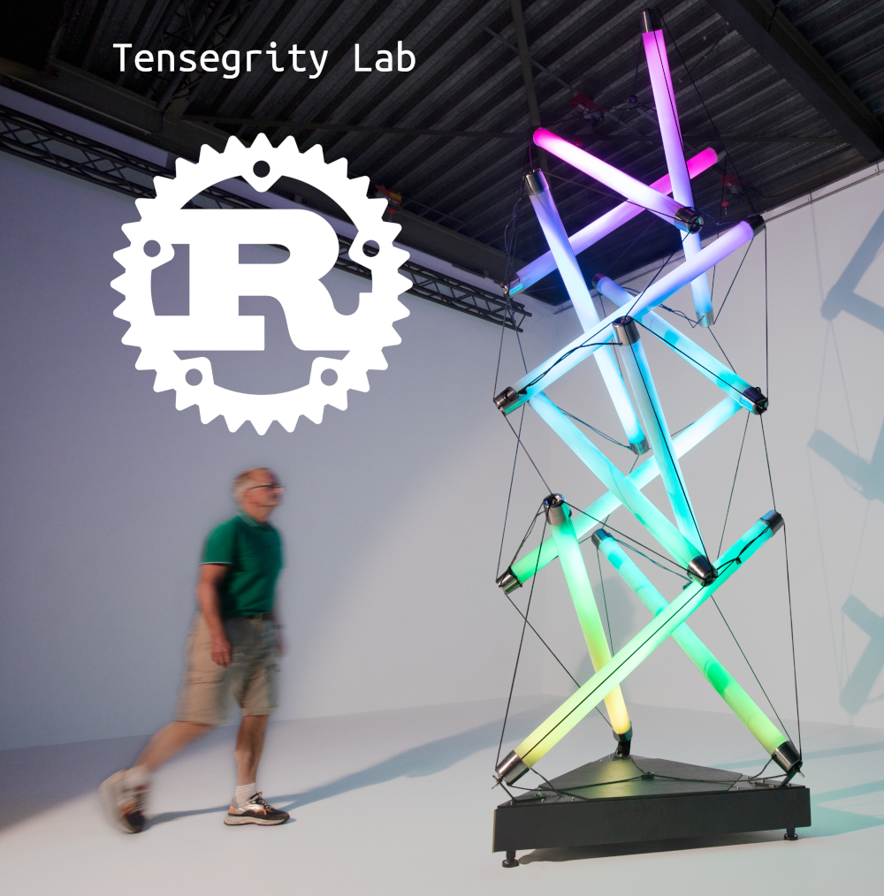

# Tensegrity Lab

Tensegrity Lab is for efficiently exploring spatial structures based on
pure pairwise push and pull forces using Rust Language.

## Origin

This is a deeper exploration of what originated as a project
partly written in Rust but mostly in Typescript which is published on [pretenst.com](https://pretenst.com/)
as an online [application](https://pretenst.com/app/#construction;Halo-by-Crane), and used to
design and support building real-world complex tensegrity structures.

## Goals

This project dives deeper with a high-performance implementation, going 100% [Rust](https://www.rust-lang.org/),
so that new experiments can be constructed involving optimizations such as the trial-and-error
genius of Darwinian evolution that brought about life on Earth.

## Contact

If you find this interesting and you want to know more, drop us a line at **pretenst@gmail.com**. 

## Running on web

1. `wasm-pack build --target web`
2. Serve website locally from project directory using e.g. miniserve
   1. `brew install miniserve`
   2. `miniserve . --index index.html`
3. Navigate to `http://127.0.0.1:8080`

Press F for fullscreen.