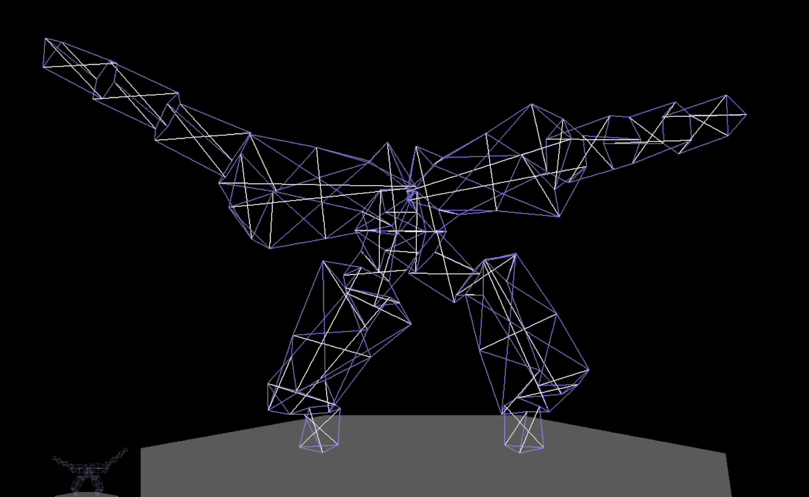

# Tensegrity Lab

Tensegrity Lab is for efficiently exploring spatial structures based on
pure pairwise push and pull forces using the [Rust](https://www.rust-lang.org/) stack.

To get a quick idea of what kind of things can be designed and experimented with, take a moment to view this movie made from a screen recording:

Play the [video](https://vimeo.com/806029888)!

This is a continuation of the [PretensT](https://pretenst.com/) Project about building both software and real-world tensegrity structures.

The goals of this project are:

* have a fast implementation of [Elastic Interval Geometry](docs/EIG.md), both native and web
* design tensegrity by melting tensegrity modules or "bricks" together, based on a homegrown language called [Tenscript](docs/Tenscript.md)
* facilitate the building of designed structures with [real materials](https://pretenst.com/)
* construct a Darwinian evolution of competing tensegrities with arbitrary fitness function

### Two Versions

There are two different versions which are maintained in parallel, the web version and the native version.

1. The native version is minimal, specifically made for designing tensegrities by composing scripts in an invented language called *"tenscript"*. It watches the script file for changes, and rebuilds your design if necessary. Don't underestimate how tricky it can be to script the generation of tensegrity.
1. The web version allows for selecting from the existing designs and is intended to facilitate building the physical tensegrity structures. When you click on the structure, you select a joint, and then you can select one of its adjacent intervals. The details about the interval appear above so you can construct a real world tensegrity. Scale can be calibrated easily.

None of this is really documented well enough yet that it is easy for beginners. You kind of have to want to dig in.

If you want to know more, please contact **pretenst@gmail.com**. 

### Running Tensegrity Lab

First you will need Rust installed, and your copy of the source code.

1. [install rust](https://www.rust-lang.org/tools/install)
1. clone the [repository](https://github.com/elastic-interval/tensegrity-lab.git)
1. move into the **tensegrity-lab** directory

To run the web version:

1. [install trunk](https://trunkrs.dev/guide/getting-started/installation.html)
1. command:

   trunk serve

To run the native version:

1. command:

    cargo run -- --fabric "Halo by Crane"

