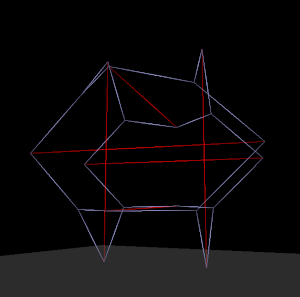

# Tenscript

The tenscript language has an [s-expression](https://en.wikipedia.org/wiki/S-expression) syntax and it is implemented using the [Pest](https://pest.rs/) parser.

The basic idea is that of building by connecting bricks together, only here the bricks are actually tensegrity modules and the way that they are connected is by unifying pairs of faces.

As is common in the world of programming, one of the most important issues is **naming things**, and in tenscript the challenge is to name the bricks and specifically the faces. For this, the language has a rather elaborate system of **aliases** which must be mastered.

## Brick Library

Bricks are tensegrity modules which are designed to join with each other at their faces. Once multiple individual bricks are connected, they become one tensegrity structural whole.

Tensegrity bricks are intially described as "prototypes" in purely logical terms, specifying only which compression and tension elements exist and how they are connected to each other. So initially the joints of a brick (where the compression/tension elements meet) do not have proper coordinates.  Instead, things are somewhat arbitrarily placed in space and the system relies on the pushing and pulling forces to reshape the brick until these forces reach an equilibrium.

The process of evolving from the logical description to the proper spatial description is called "baking", and a brick is said to be baked when it reaches a state close enough to perfect equilibrium. During baking, a brick settles into its natural shape.

The logical description specifies the pushes (compression) and pulls (tension) as well as the triangular faces (where bricks connect to each other), and in some cases there are extra joints defined.  

Pushes are defined in groups of a given length and to be positioned on either the X, Y, or Z axis with their midpoints on the origin (during baking they shift) and the push elements have the added important effect of naming the joints (their ends).

Pulls are defined in groups of a given length and make use of the joint names that were introduced to be the ends of the push elements. When there are joints in the brick tensegrity structure which only bring together pull elements (cables only), these joints can be specified separate from the pushes, and these are initially positioned on the origin.

Finally, the faces are defined by sets of three joints each, ordered according to the [right hand rule](https://en.wikipedia.org/wiki/Right-hand_rule) so that the "outward" direction can always be derived. But tensegrity faces all have either left or right spin to them, called "chirality" so every face also specifies whether it is left or right chirality.

A face is actually implemented as a joint at the midpoint and three radial pull elements from the midpoint to the corners of the triangular face, since the face plays the role of holding the corners together.

### Simple Grow Bricks

There are two bricks which are used to grow columns of tensegrity, one with left-handed chirality and one with right-handed chirality.  These are the simplest bricks and they consist only three pushing elements, and three pulling elements, with two faces at either end.

This is the prototype specification of the right-handed simple brick:

	(pushes X 3.204 
		(push :alpha_x :omega_x))
	(pushes Y 3.204 
		(push :alpha_y :omega_y))
	(pushes Z 3.204 
		(push :alpha_z :omega_z))
	(pulls 2.0
		(pull :alpha_x :omega_z :pull)
		(pull :alpha_y :omega_x :pull)
		(pull :alpha_z :omega_y :pull))
	(faces 
		(right :alpha_z :alpha_y :alpha_x) 
		(right :omega_x :omega_y :omega_z))

The faces are ordered, and what then follows is the various alias-based naming of the faces:

	(face-aliases (with :right) 
		(alias :base) (alias Top :next-base))
	(face-aliases (with :seed) 
		(alias :base) (alias Top :next-base)))

These sets of aliases describe two different uses of this brick. The first here is used when the brick is being used to grow on top of an existing face, while the second is used when this brick is the first one, the "seed", and does not connect to anything yet.

After the baking process is completed, the end result contains proper spatial coordinates, and no longer contains the joint names:

	(baked
		(joint -1.4913 -0.3875 0.0099)
		(joint 1.4913 -0.0099 0.3875)
		(joint 0.0099 -1.4913 -0.3875)
		(joint 0.3875 1.4913 -0.0099)
		(joint -0.3875 0.0099 -1.4913)
		(joint -0.0099 0.3875 1.4913)
		(interval 2 3 -0.0531 :push)
		(interval 2 1 0.1171 :pull)
		(interval 4 5 -0.0531 :push)
		(interval 0 5 0.1171 :pull)
		(interval 0 1 -0.0531 :push)
		(interval 4 3 0.1171 :pull)
		(right 4 2 0 (alias :base :right Single) (alias :base :seed Single))
		(right 1 3 5 (alias :next-base :right Single Top) (alias :next-base :seed Single))))

### Branching Bricks

The simple bricks described above only have two faces, so they can only be chained together to make columns of tensegrity. Slightly more elaborate bricks have eight faces, and so far there is the symmetrical *"Omni-Twist"* and several variations on the elongated and twistable *"Torque"* brick shape. These bricks have four right-handed faces and four left-handed ones.

Once one of these branching bricks is attached to an existing face, there are choices regarding which of the remaining seven faces to attach subsequent bricks, and of course multiple faces can be used.

## Fabric Library

The fabric library contains a growing number of fabrics or tensegrity constructions described as connected bricks.

Since there is branching, the *Tenscript* language has some recursive nesting in its *build* instructions.

A fairly simple example is *"Halo by Crane"* described by this *Tenscript*.

	  (fabric
	    (name "Halo by Crane")
	    (build
	      (branch (alias Single) (rotate) (rotate)
	        (face (alias :next-base)
	          (grow 4 (scale .92)
	            (branch (alias Omni)
	              (face (alias TopX) (grow 12 (scale .92) (mark :halo-end)))
	              (face (alias TopY) (grow 11 (scale .92) (mark :halo-end))))))))
	    (shape
	      (join :halo-end)
	      (vulcanize)
	      (faces-to-triangles))
	    (pretense (surface :frozen)))

What happens here in the **growth** phase is thet first the stem is built by growing four twists on top of a base twist, while scaling down from one to the next, and then it branches using the *Omni-Twist* brick.

From there, two arms are grown out as long columns of twists from faces tagged *TopX* and *TopY* in the brick, both also scaling down each step as they grow.

Finally the ends of the arms are marked *:halo-end* so that in the **shaping** phase, the command can be given to **join** the two ends of the arms together so that they meet in the middle and are woven together.

Following the join command comes *vulcanize*, which adds extra support tension intervals to make the tensegrity more rigid, and the faces with radial tension are replaced by tension triangles with *faces-to-triangles*.

Finally, the *pretense* phase describes the world in which the structure will end up, in this case specifying a *frozen* surface which permanently grabs and fixes any joint that touches the surface.

---

*Tenscript is a work-in-progress and will presumably evolve more* 
